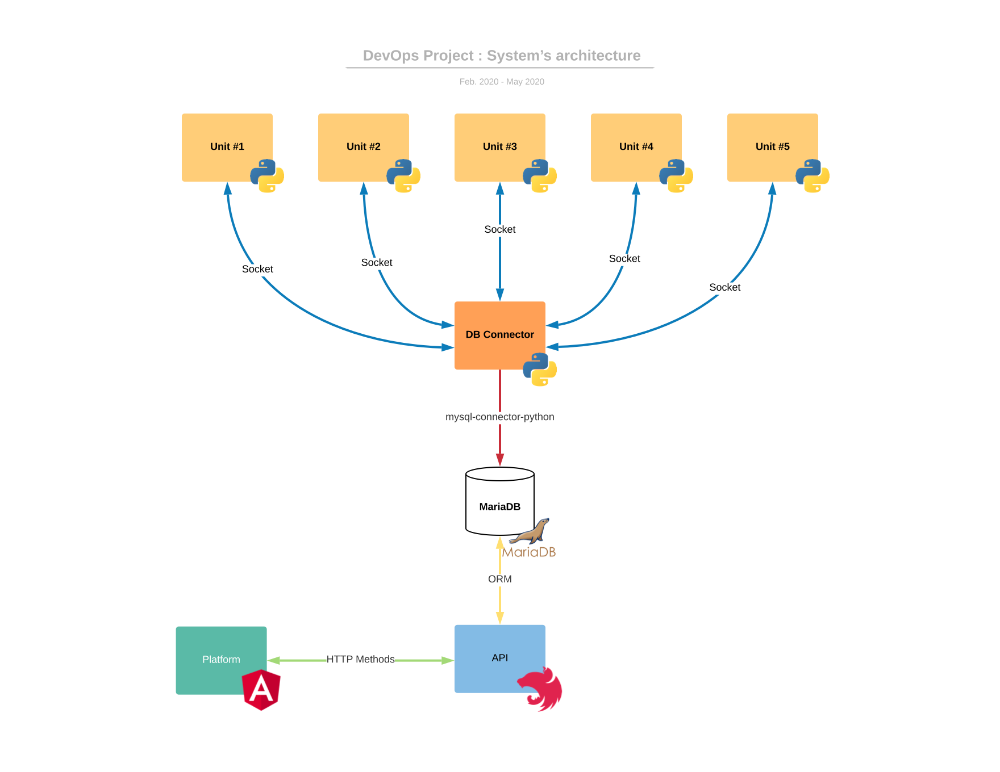

<h1 align="center">:link: DevOps Project :link:</h1>

<div align="center">

[](https://shields.io/) [](https://github.com/MathisLeRoyNivot/devops-project/blob/master/LICENSE)

[](https://forthebadge.com) [](https://forthebadge.com)

</div>

## Table of content :open_file_folder:

- [**Architecture**](#architecture)
- [**Installation**](#installation)
    - [**Build project**](#build-project)
    - [**Run project**](#run-project)
- [**Contributors**](#contributors)
- [**License**](#license)

<div id="architecture">

## Architecture :construction:

<div align="center">



</div>

</div>

<div id="installation">

## Installation :wrench:

<div id="build-project">

### **Build project**

> Make sure **Docker** :whale: is running on your computer

```docker
docker-compose build
```

</div>

<div id="run-project">

### Run poject

```docker
docker-compose up
```

</div>

</div>

<div id="contributors">

## Contributors :computer:

- [Adrien VAUCARD](https://github.com/adrienvaucard "Go to @adrienvaucard's Github")
- [Mathis LE ROY-NIVOT](https://github.com/MathisLeRoyNivot "Go to @MathisLeRoyNivot's Github")
- [Tanguy POTIER](https://github.com/tanguy85 "Go to @tanguy85's Github")

</div>

<div id="license">

## License :white_check_mark:

[](https://github.com/MathisLeRoyNivot/devops-project/blob/master/LICENSE)

</div>